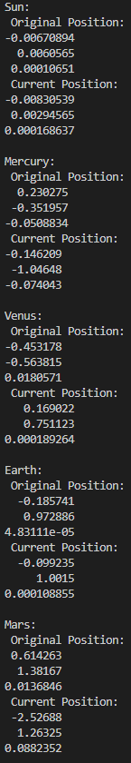

PHAS0100Assignment2
------------------

[](https://travis-ci.com/[USERNAME]/PHAS0100Assignment2)
[](https://ci.appveyor.com/project/[USERNAME]/PHAS0100Assignment2)


Purpose
-------

This project serves as a starting point for the PHAS0100 Assignment 2 Gravitational N-body Simulation coursework. It has a reasonable folder structure for [CMake](https://cmake.org/) based projects,
that use [CTest](https://cmake.org/) to run unit tests via [Catch](https://github.com/catchorg/Catch2). 

Further information on the specific project is left as an exercise for the student.


Credits
-------

This project is maintained by [Dr. Jim Dobson](https://www.ucl.ac.uk/physics-astronomy/people/dr-jim-dobson). It is based on [CMakeCatch2](https://github.com/UCL/CMakeCatch2.git) that was originally developed as a teaching aid for UCL's ["Research Computing with C++"](http://rits.github-pages.ucl.ac.uk/research-computing-with-cpp/)
course developed by [Dr. James Hetherington](http://www.ucl.ac.uk/research-it-services/people/james)
and [Dr. Matt Clarkson](https://iris.ucl.ac.uk/iris/browse/profile?upi=MJCLA42).


Build Instructions
------------------

Build and run instructions are left as an excercise for the student. Examples of how to build using cmake were given in lectures and in the other CMake example projects.

To build the environment:
```Bash
mkdir build
cd build
cmake ..
make
```

Command Line Instructions
------------------
****

Creating and testing a simple N-body simulator. 

***Command-Line application 1: solarSystemSimulator***

The guidance of solarSystemSimulator apps
```Bash
./bin/solarSystemSimulator -h
```
or
```Bash
./bin/solarSystemSimulator --help
```

The simulator contains 9 planets in total. Users should enter the ***1.) step size*** and ***2.) Total time*** to generate the solar system simulator: 

```Bash
./bin/solarSystemSimulator <step size> <Total time>
```

***(unit : year)***

***Command-Line application 2: randomParticleGenerator***

The guidance of randomParticleGenerator apps
```Bash
./bin/randomParticleGenerator -h
```
or
```Bash
./bin/randomParticleGenerator --help
```

The simulator contains 2000 random planets in total. Users should enter the ***1.) step size*** and ***2.) Total time*** to generate the solar system simulator: 

```Bash
./bin/randomParticleGenerator <step size> <Total time>
```

***(unit : year)***

### ***Unit Test***
```Bash
ctest -V
```

Simulation Analysis
------------------
****

Task 3:

Screen summarising the position of the solar system bodies at the start and end of the simulation using a timestep of 0.000274 years and  run the program for 1 year of simulated time. 

****
 
.png) 
****

Task 4:

Energy:
--------
****

Simulated Time : 100 (year) 

|**Timestep**|**Ekinetic**|**Epotential**|**Etotal**|**CPU time(ms)**|**Wall clock time(ms)**|
| :----: | :----: | :----: | :----: | :----: | :----: |
|Begining| 0.187358 | -0.356872 | -0.169514 |
|0.00000274|0.154577 | -0.323841 | -0.169264|-|-|
|0.0000137| 0.152166 |  -0.320757 | -0.168591 |632422|632422|
|0.0000274| 0.150472 |  -0.318517 | -0.168045 |305100|305102|
|0.000274| 0.131274 |  -0.295629 | -0.164355 |30827.2|30830|
|0.00274(1day)| 0.217378 |-0.365259 | -0.14788 |3031.71|3031.91|
|0.0274| 0.0718046 |-0.165777 | -0.0939721 |307.917|307.915|

The smaller the step size, the more accurate the result， the longer the running time.

Task 7:

Simulation Time with OpenMP: (2000 Random Particles)
------------------

step size = 0.0274
total time = 1


|**number of thread**|**CPU Time**|**Wall clock time**|
| :----: | :----: | :----: |
| No OpenMP | 167840 ms  | 167841 ms |
| 2  |  188541 ms   | 94383.5 ms  |
| 4  |  202869 ms  | 51798.7 ms  |
| 8  |  233146 ms  | 30120.3 ms  |
| 12 |  285080 ms | 24196.4 ms   |
| 16 |  330160 ms | 21456.7 ms   |

***Comment:***

As the threads increasing, the running time increases (CPU TIME) while the Wall clock time decreases. Due to the limitation of the loop iteration, it needs extra time to do the simulation in each thread. Also, it takes time to switch the threads.